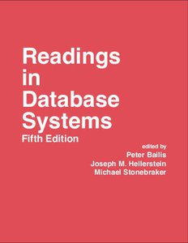

# Lerne selber Informatik
Als autodidaktische/r Ingenieur/in oder Bootcamp-Absolvent/in musst du es dir Informatik selber beibringen. Zum Glück kannst du dir eine erstklassige Informatikausbildung verschaffen, ohne Jahre und ein kleines Vermögen in ein Studium zu investieren 💸.

Es gibt da draußen zahlreiche Ressourcen zum lernen, manche davon besser als andere. Dabei brauchst du jedoch nicht nochmal eine weitere Liste von "200+ kostenlosen Online-Kursen". Das was du brauchst, sind Antworten auf die Fragen:

* **Welche Themen** soll ich lernen, und warum?
* Was sind die **besten Lektüren oder Vorlesungsreihen** für jedes Thema?

Dieser Leitfaden versucht, diese Fragen endgültig zu beantworten.

## Gliederung

Am besten wäre es, wenn du alle unten aufgeführten Themen in der gegebenen Reihenfolge mithilfe der angegebenen Lernmaterialien lernst. Du musst mit ca. 100-200 Lernstunden pro Thema rechenen.

| Thema                                                                   | Weshalb lernen?                                                                                                                                                                                            | Buch                                                         | Videovorlesung                      |
| --------------                                                          | ---------------                                                                                                                                                                                            | ----                                                         | --------------                      |
| **[Programmierung](#programmierung)**                                   | Sei nicht die Person, die Rekursion "nie ganz verstanden" hat.                                                                                                                                             | *Structure and Interpretation of Computer Programs*          | Berkeley CS 61A von Brian Harvey    |
| **[Computerarchitektur](#computerarchitektur)**                         | Ohne eine solide Darstellung, wie Computer tatsächlich funktionieren, werden all deine höhere Abstraktionen brüchig sein.                                                                                  | *Computer Systems: A Programmer's Perspective*               | Berkeley CS 61C                     |
| **[Algorithmen und Datenstrukturen](#algorithmen-und-datenstrukturen)** | Wenn du nicht weißt, wie du allgegenwärtige Datenstrukturen wie Stapel, Warteschlangen, Bäume und Graphen verwenden sollst, wirst du schwierige Probleme nicht lösen können.                               | *The Algorithm Design Manual*                                | Vorlesungen von Steven Skiena       |
| **[Mathematik für Informatik](#mathematik-für-informatik)**            | Informatik ist im Grunde ein Zweig der angewandten Mathematik, also wir dir das Mathe lernen einen Wettbewerbsvorteil verschaffen.                                                                         | *Mathematics for Computer Science*                           | MIT 6.042J von Tom Leighton         |
| **[Betriebssysteme](#betriebssysteme)**                                 | Der Großteil von Code, den du schreibst, wird vom einem Betriebssystem ausgeführt. Du solltest also wissen, wie diese Systeme zusammenwirken.                                                              | *Operating Systems: Three Easy Pieces*                       | Berkeley CS 162                     |
| **[Computernetzwerke](#computernetzwerke)**                             | Das Internet stellte sich als große Sache heraus. Lerne, wie es funktioniert, um sein volles Potenzial zu erschließen.                                                                                     | *Computer Networking: A Top-Down Approach*                   | Stanford CS 144                     |
| **[Datenbanken](#datenbanken)**                                         | Daten sind das Herzstück vieler wichtigen Anwendungen, aber nur wenige verstehen, wie Datenbanksysteme wirklich funktionieren.                                                                             | *Readings in Database Systems*                               | Berkeley CS 186 von Joe Hellerstein |
| **[Sprachen und Compiler](#sprachen-und-compiler)**                     | Wenn du verstehst, wie Sprachen und Compiler tatsächlich funktionieren, wirst du besseren Quellcode schreiben und neue Sprachen einfacher lernen können.                                                   | *Crafting Interpreters*                                      | edX Kurs von Alex Aiden             |
| **[Verteilte Systeme](#verteilte-systeme)**                             | Heutzutage bestehen die *meisten* Systeme aus verteilten Systemen.                                                                                                                                         | *Designing Data-Intensive Applications* von Martin Kleppmann | MIT 6.824                           |

## Immer noch zu viel?

Ist dir die Vorstellung, 9 Themen über mehrere Jahre selber beizubringen, zu überwältigend, empfehlen wir, du fokoosierst dich nur auf zwei Bücher: *Computer Systems: A Programmer's Perspective* und *Designing Data Intensive Applications*. Erfahrungsgemäß bieten diese zwei Bücher einen unglaublich hohen Mehrwert, insbesondere für autodidaktische Ingenieur/innen und Bootcamp-Absolvent/innen, die an vernetzten Anwendungen arbeiten. Sie können auch als eine "Einstiegsdroge" für die weiteren oben aufgelisteten Themen dienen.

## Warum Informatik lernen?

Es gibt zwei Arten von Softwareingenieur/innen: Die einen, die Informatik ausreichend gut verstehen, um anspruchsvolle, innovative Arbeit zu leisten, und die anderen, die nur über die Runden kommen, weil sie mit einigen high-level Tools vertraut sind.

Beide nennen sich Softwareingenieur/in, und beide verdienen ähnlich viel in den frühen Berufsjahren. Aber Ingenieur/innen der 1. Art entwickeln sich mit der Zeit zu erfüllenderen und besser vergüteten Arbeit, sei es wertvolle kommerzielle Arbeit, bahnbrechende Open-Source Projekte, technische Führung oder hochwertige individuelle Beiträge.

Ingenieur/innen der 1. Art finden Wege, um Informatik tiefer zu erlernen, sei es mit konventionellen Mitteln oder durch unermüdliches Lernen im Laufe der Karriere. Ingenieur/innen der 2. Art bleiben typischerweise an der Oberfläche, lernen bestimmte Tools und Technologien anstatt deren Grundlagen, und eignen sich nur dann neue Fähigkeiten an, wenn die Winde technologischer Trends sich drehen.

Zur Zeit steigt die Anzahl der Berufseinsteiger in der Branche rasch an, während die Anzahl an Informatikabsolvent/innen relativ stabil bleibt. Dieses Überangebot an Ingenieur/innen der 2. Art reduziert inzwischen ihre Berufschancen und hält sie von der erfüllenderen Arbeit in der Branche fern. Egal ob du anstrebst, ein/e Ingenieur/in der 1. Art zu werden, oder mehr Jobsicherheit suchst: Informatik zu lernen ist der einzige zuverlässige Weg.

Für Aktualisierungen am Leitfaden und allgemeine Informatiknachrichten und -ressourcen, wärst du vielleicht an der Mailingliste von Bradfield interessiert.

## Leitfäden der Themen

### Programmierung

Die meisten Grundstudiengänge in der Informatik beginnen mit einer "Einführung" in die Computerprogrammierung. Die besten Versionen dieser Kurse richten sich nicht nur an Anfänger, sondern auch an diejenigen, die nützliche Konzepte und Programmiermodelle beim ersten Erlernen des Programmierens verpasst haben.

Unsere Standardempfehlung für diesen Inhalt ist der Klassiker *Structure and Interpretation of Computer Programs*, der online kostenlos als [Lehrbuch](https://sarabander.github.io/sicp/html/index.xhtml) und als Reihe von [Videovorlesungen am MIT](https://sarabander.github.io/sicp/html/index.xhtml) verfügbar ist. Obwohl diese Vorlesungen hervorragend sind, empfehlen wir als Videovorlesung stattdessen die [SICP Vorlesungen von Brian Harvey](https://archive.org/details/ucberkeley-webcast-PL3E89002AA9B9879E?sort=titleSorter) (vom Kurs 61A in Berkeley). Diese sind ausgefeilter und besser für neue Studierende geeignet als die MIT-Vorlesungen.

Wir empfehlen, wenigstens die ersten drei Kapitel von SICP und die Übungsaufgaben durchzuarbeiten. Als zusätzliche Übung, bearbeite eine Reihe von kleinen Programmieraufgaben, z.B. die Aufgaben auf [exercism](https://exercism.org/).

Seit dieser Leitfaden in 2016 zuerst veröffentlicht wurde, war eine der meist gestellten Fragen ob wir inzwischen eine aktuellere Aufzeichnung von Kurs 61A von John DeNero, oder das entsprechende Lehrbuch [Composing Programs](https://composingprograms.com/) empfehlen würden, das in der "Tradition von SICP" steht, aber Python verwendet. Wir sind der Meinung, diese Ressourcen von DeNero sind auch großartig, und manche Studierende werden diese bevorzugen, aber wir schlagen trotzdem vor, SICP, Scheme und Brian Harveys Vorlesungen als erste Ressourcen auszuprobieren.

Weshalb? Weil SICP einzigartig in seiner Fähigkeit ist, zumindest potenziell deine grundlegenden Überzeugungen über Computern und Programmierung zu verändern. Nicht alle werden diese Erfahrung machen. Manche werden das Buch hassen, andere schaffen es nicht weiter als die ersten paar Seiten. Aber der potentielle Gewinn macht es einen Versuch wert.

Wenn du an SICP keinen Spaß findest, versuche es mit *Composing Programs*. Wenn dir das immer noch nicht zusagt, probiere [How to Design Programs](http://htdp.org/) aus. Wenn sich deine Bemühungen trotzdem nicht lohnen, ist es vielleicht ein Zeichen dafür, dass du dich zunächst auf andere Themen konzentrieren und in 1-2 Jahren wieder auf das Disziplin der Programmierung zurückkommen solltest.

Abschließend eine Klarstellung: Dieser Leitfaden ist NICHT für absolute Programmieranfänger ausgelegt. Wir nehmen an, du bist bereits kompetent im Programmieren ohne Informatikhintergrund, und möchtest Wissenslücken schließen. Die Tatsache, dass wir einen Abschnitt über Programmierung eingefügt haben, ist lediglich eine Erinnerung daran, dass es noch mehr zu lernen geben kann. Für diejenigen, die noch nie programmiert haben, es aber gern tun würden, wäre vielleicht [dieser Leitfaden](https://www.reddit.com/r/learnprogramming/wiki/faq/#wiki_getting_started) der richtige.

### Computerarchitektur

> Hardware ist die Plattform.

_– Mike Acton, Engine Direktor von Insomniac Games_

Computerarchitektur - manchmal auch "Computersysteme" oder "Computerorganisation" genannt - ist ein wichtiger erster Einblick in die Computertechnik unterhalb der Oberfläche von Software. Erfahrungsgemäß ist es das meist vernachlässigte Thema unter den autodidaktischen Ingenieur/innen.

Unser Lieblingsbuch zur Einführung ist [Computer Systems: A Programmer's Perspective](http://csapp.cs.cmu.edu/3e/home.html), und ein typischer Einführungskurs in die Computerarchitektur, der auf dieses Lehrbuch stützt, würde das meiste aus Kapiteln 1-6 [abdecken](http://csapp.cs.cmu.edu/3e/courses.html).

Wir lieben CS:APP für seinen praktischen, Programmierer-orientierten Ansatz. Obwohl das Buch weit nicht alles über Computerarchitektur abdeckt, ist es ein toller Ausgangspunkt für diejenigen, die in erster Linie Computersysteme verstehen wollen, um schnellere, effizientere und zuverlässigere Software zu schreiben.

Für die, die eine sanftere Einführung in das Thema und ein Gleichgewicht zwischen Hardware- und Softwarefragen bevorzugen, schlagen wir "_The Elements of Computing Systems_" vor, auch bekannt als "Nand2Tetris". Dies ist ein ehrgeiziges Werk, das versucht, ein zusammenhängendes Verständnis zu vermitteln, wie alles in einem Computer funktioniert. Jedes Kapitel beschäftigt sich mit dem Aufbau eines Teils vom System, vom Schreiben elementarer Logikgatter in HDL, über CPU und Assembler bis hin zu einer Anwendung in der Größe eines Tetris-Spiels.

Wir empfehlen, die ersten sechs Kapitel des Buches und die zugehörigen Projekte durchzuarbeiten. Dies wir dein Verständnis über den Zusammenhang der Maschinenarchitektur und der darauf laufenden Software weiterentwickeln.

Die erste Hälfte des Buches (und alle dazugehörigen Projekte) sind kostenlos auf der [Nand2Tetris Webseite](https://www.nand2tetris.org/) verfügbar. Es ist ebenso als [Coursera-Kurs mit begleitenden Videos](https://www.coursera.org/learn/build-a-computer) vorhanden.

Das Bestreben nach Einfachheit und Kohärenz von Nand2Tetris geht auf Kosten der Tiefe. Insbesondere fehlen zwei sehr wichtige Konzepte der modernen Computerarchitektur, nämlich Pipelining und Speicherhierarchie, weitgehend in diesem Text.

Sobald du dich mit dem Inhalt von Nand2Tetris vertraut gemacht hast, empfehlen wir, entweder zu CS:APP zurückzukehren, oder ["Computer Organizsation and Design"](https://www.amazon.com/Computer-Organization-Design-Fifth-Architecture/dp/0124077269?pldnSite=1) von Patterson und Hennessy in Erwägung zu ziehen, ein ausgezeichnetes und mittlerweile klassisches Lehrbuch. Nicht jeder Abschnitt vom Buch ist essenziell, wir schlagen vor, [Kurs CS61C](https://inst.eecs.berkeley.edu/~cs61c/sp15/) "Great Ideas in Computer Architecture" von Berkeley für ausgewählte Lektüren zu verfolgen. Die Vorlesungsskripten und Übungen sind online verfügbar, und die vergangenen Vorlesungen befinden sich [auf dem Internet Archive](https://archive.org/details/ucberkeley-webcast-PL-XXv-cvA_iCl2-D-FS5mk0jFF6cYSJs_).

([Siehe seinen CppCon Vortrag an](https://www.youtube.com/watch?v=rX0ItVEVjHc))

### Algorithmen und Datenstrukturen

> Ich habe nur eine Methode, die ich ausgiebig empfehle -- Denke nach bevor du schreibst.

_— Richard Hamming_

Wir sind uns mit jahrzehntelanger Weisheit einig, dass Vertrautheit mit gängigen Algorithmen und Datenstrukturen eine der meist ermächtigenden Aspekte der Informatikausbildung darstellt. Dies ist auch eine großartige Stelle, die eigene Problemlösungsfähigkeit zu trainieren, die sich in allen anderen Studienbereichen auszahlen wird.

Es sind Hunderte von Büchern vorhanden, aber unser Favorit ist [The Algorithm Design Manual](https://www.amazon.com/Algorithm-Design-Manual-Steven-Skiena/dp/1848000693/?pldnSite=1) von Steven Skiena. Er liebt offensichtlich das algorithmische Lösen von Problemen und schafft es typischerweise, ähnliche Begeisterung bei seinen Studierenden und Leser/innen zu wecken. Unserer Meinung nach sind die zwei häufiger Empfohlenen Texte (CLRS und Sedgewick) tendenziell zu beweislastig für diejenigen, die den Stoff vorwiegend als Hilfe bei der praktischen Problemlösung lernen.

Für die, die Videovorlesungen bevorzugen, hat [Skiena großzügigerweise seine online gestellt](https://www3.cs.stonybrook.edu/~skiena/373/videos/). Wir mögen auch Tim Roughgardens Kurs sehr, verfügbar [auf Coursera](https://www.coursera.org/specializations/algorithms) und [anderswo](http://timroughgarden.org/videos.html). Ob du den Vorlesungsstil von Skiena oder Roughgarden bevorzugst ist eine Frage der persönlichen Präferenz. In der Tat gibt es Dutzende von guten Alternativen. Wenn du also eine findest, die dir gefällt, empfehlen wir, bei dieser zu bleiben!

Zur Übung bevorzugen wir, dass Studierende Aufgaben auf [Leetcode](https://leetcode.com/) lösen. Diese sind tendenziell interessante Probleme mit ordentlichen begleitenden Lösungen und Diskussionen. Sie helfen auch, deinen Fortschritt anhand von Fragen zu messen, die häufig in technischen Interviews bei kompetitiven Softwareunternehmen gestellt werden. Wir empfehlen, etwa 100 beliebige leetcode Aufgaben im Rahmen des Studiums zu lösen.

Abschließend empfehlen wir [How to Solve it](https://www.amazon.com/How-Solve-Mathematical-Princeton-Science/dp/069116407X/?pldnSite=1) als hervorragenden und einzigartigen Leitfaden für die allgemeine Problemlösung, der für die Informatik ebenso anwendbar ist wir für die Mathematik.

### Mathematik für Informatik

> Wenn Leute nicht glauben, dass Mathematik einfach ist, liegt es nur daran, dass sie nicht wissen, wie kompliziert das Leben ist.

_-John von Neumann-_

In gewisser Weise ist die Informatik ein verwachsener Zweig der angewandten Mathematik. Obwohl viele Softwareingenieur/innen versuchen - mit mehr oder weniger Erfolg - dies zu ignorieren, ermutigen wir dich dazu, dich mit direktem Studium darauf einzulassen. Wenn du dies erfolgreich tust, hat du gegenüber denen, die es nicht tun, einen enormen Wettbewerbsvorteil.

Der relevanteste Bereich der Mathematik für Informatik wird allgemein "diskrete Mathematik" genannt, wobei "diskret" das Gegenteil von "stetig" ist, und eine Sammlung interessanter mathematischer Themen außerhalb der Infinitesimalrechnung darstellt. Mit dieser vagen Definition macht es wenig Sinn, die gesamte Breite der "diskreten Mathematik" abzudecken. Ein realistischeres Ziel ist es, ein funktionierendes Verständnis der Logik, Kombinatorik und Wahrscheinlichkeitsrechnung, Mengentheorie, Graphentheorie, und etwas Zahlentheorie für die Kryptographie aufzubauen. Lineare Algebra ist ein zusätzliches lohnendes Studiengebiet, angesichts ihrer Bedeutung für Computergraphik und maschinelles Lernen.

Unser empfohlener Ausgangspunkt für diskrete Mathematik ist das [Vorlesungsskript von László Lovász](https://cims.nyu.edu/~regev/teaching/discrete_math_fall_2005/dmbook.pdf). Prof. Lovász hat es geschafft, den Inhalt zugänglich und intuitiv zu gestalten, also dient dies als besserer Ausgangspunkt als formalere Texte.

Für eine fortgeschrittenere Behandlung empfehlen wir [Mathematics for Computer Science](https://courses.csail.mit.edu/6.042/spring17/mcs.pdf), das Skript in Buchlänge für die gleichnamige MIT-Vorlesung. Die dazugehörigen Videoaufzeichnungen sind auch [frei verfügbar](https://ocw.mit.edu/courses/6-042j-mathematics-for-computer-science-fall-2010/video_galleries/video-lectures/), und sind unsere empfohlenen Videovorlesungen für diskrete Mathematik.

Für lineare Algebra schlagen wir vor, mit der Videoreihe [Essence of linear algebra](https://www.youtube.com/playlist?list=PLZHQObOWTQDPD3MizzM2xVFitgF8hE_ab) anzufangen, gefolgt vom [Lehrbuch](https://www.amazon.com/Introduction-Linear-Algebra-Gilbert-Strang/dp/0980232775/) und [Videovorlesungen](https://ocw.mit.edu/courses/18-06sc-linear-algebra-fall-2011/) von Gilbert Strang.

### Betriebssysteme

[Operating System Concepts](https://www.amazon.com/dp/1118063333/) (das "Dinosaurierbuch") und [Modern Operating Systems](https://www.amazon.com/dp/013359162X/) sind die Klassiker über Betriebssysteme. Beide haben aufgrund ihrer mangelnden Klarheit und allgemeinen Unfreundlichkeit für Studierende Kritik geerntet.

_Operating Systems: Three Easy Pieces_ ist eine gute Alternative, die [online kostenlos verfügbar](https://pages.cs.wisc.edu/~remzi/OSTEP/) ist. Wir schätzen insbesondere die Struktur und Lesbarkeit des Buches, und halten die Übungsaufgaben für lohnend.

Nach OSTEP, empfehlen wir dir, dich mit den Designentscheidungen bestimmter Betriebssysteme zu befassen, mit Büchern im Stil von "{Betriebssystemname} Internals", wie z.B. [Lions' Commentary on Unix](https://www.amazon.com/Lions-Commentary-Unix-John/dp/1573980137/), [Design and Implementation of the FreeBSD Operating System](https://www.amazon.com/Design-Implementation-FreeBSD-Operating-System/dp/0321968972/), und [Mac OS X Internals](https://www.amazon.com/Mac-OS-Internals-Systems-Approach/dp/0321278542/). Für Linux empfehlen wir Robert Loves fantastisches [Linux Kernel Development](https://www.amazon.com/Mac-OS-Internals-Systems-Approach/dp/0321278542).

Eine gute Art, dein Verständnis über Betriebssysteme zu festigen, ist den Quellcode eines kleinen Kernels zu lesen und neue Funktionen hinzuzufügen. Eine Möglichkeit ist [xv6](https://pdos.csail.mit.edu/6.828/2016/xv6.html), eine Portierung von Unix V6 auf ANSI C und x86, die für einen Kurs am MIT gepflegt wird. OSTEP hat einen Anhang mit potentiellen [xv6 Praktika](https://pages.cs.wisc.edu/~remzi/OSTEP/lab-projects-xv6.pdf) voller großartiger Ideen für potentielle Projekte.

### Computernetzwerke

> Du kannst nicht in die Kristallkugel blicken und die Zukunft sehen. Was das Internet in Zukunft wird, ist das, was die Gesellschaft daraus macht.

— _Bob Kahn_

Da sich ein Großteil der Softwareentwicklung an Webservern und -clients bezieht, sind Computernetzwerke einer der unmittelbar nützlichsten Bereiche der Informatik. Unsere autodidaktischen Studierende, die sich methodisch mit Netzwerken befassen, stellen fest, dass sie endlich Begriffe, Konzepte und Protokolle verstehen, von denen sie jahrelang umgeben waren.

Unser Lieblingsbuch zum Thema ist [Computer Networking: A Top-Down Approach](https://www.amazon.com/Computer-Networking-Top-Down-Approach-7th/dp/0133594149/?pldnSite=1). Die kleinen Projekte und Übungen im Buch zahlen sich sehr aus, und wir mögen insbesondere die "Wireshark Praktika", die sie großzügigerweise [online zur Verfügung gestellt haben](http://www-net.cs.umass.edu/wireshark-labs/).

Für diejenigen, die Videovorlesungen bevorzugen, schlagen wir Stanfords Kurs [Introduction to Computer Networking](https://www.youtube.com/playlist?list=PLoCMsyE1cvdWKsLVyf6cPwCLDIZnOj0NS), damals verfügbar über Stanfords MOOC-Plattform Lagunita, aber leider jetzt nur noch als inoffizielle Playlisten auf YouTube verfügbar ist.

### Datenbanken

Es erfordert mehr Arbeit, autodidaktisch über Datenbanksysteme zu lernen als über andere Themen. Es ist ein relativ neues (i.e. ab den 1970-ern) Gebiet mit starkem kommerziellen Anreiz, weshalb gewisse Ideen unter Verschluss bleiben. Zudem haben viele Autoren exzellenter Lehrbücher bevorzugt, stattdessen Firmen beizutreten oder solche zu gründen.

Unter diesen Umständen, empfehlen wir allen Selbstlernern Lehrbücher allgemein zu vermeiden, und mit Aufzeichnungen von CS 186 anzufangen, Joe Hellersteins Kurs über Datenbanken in Berkeley, und daraufhin langsam mit dem Lesen von Papern weiterzumachen.

Ein besonders nennenswertes Paper für neue Studierende ist ["Architecture of a Database System"](https://db.cs.berkeley.edu/papers/fntdb07-architecture.pdf), das einzigartig einen Überblick über die Funktionsweise von relationalen Datenbankmanagementsystemen (RDBMS) gibt. Dies ist eine nützliche Grundlage für weitere Studien.

_Readings in Database Systems_, besser bekannt als das ["Rote Buch" über Datenbanken](http://www.redbook.io/) ist eine Sammlung von Papern, zusammengestellt und herausgegeben von Peter Bailis, Joe Hellerstein und Michael Stonebraker. Für diejenigen, die über den Inhalt von CS 186 hinaus sind, sollte das Rote Buche die nächste Anlaufstelle sein.

Falls du darauf bestehst, ein einführendes Lehrbuch zu verwenden, empfehlen wir [Database Management Systems](https://www.amazon.com/Database-Management-Systems-Raghu-Ramakrishnan/dp/0072465638/?pldnSite=1) von Ramakrishnan und Gehrke. Für fortgeschrittenere Studierende lohnt sich Jim Grays Klassiker [Transaction Processing: Concepts and Techniques](https://www.amazon.com/Transaction-Processing-Concepts-Techniques-Management/dp/1558601902), wobei wir dies nicht als erste Quelle empfehlen.

Zum Abschluss ist Datenmodellierung ein vernachlässigter und schlecht unterrichteter Aspekt der Arbeit mit Datenbanken. Unser empfohlenes Buch hierzu ist [Data and Reality: A Timeless Perspective on Perceiving and Managing Information in Our Imprecise World](https://www.amazon.com/Data-Reality-Perspective-Perceiving-Information/dp/1935504215).

### Sprachen und Compiler

> Sei kein/e Schema-F-Programmierer/in. Stattdessen, baue Werkzeug für Benutzer/innen und andere Programmierer/innen. Beachte die Geschichte der Textil- und Stahlindustrie: Willst du Maschinen und Werkzeug bauen, oder willst du diese bedienen?

_-Ras Bodik am Anfang seines Compilerkurses_

Die meisten Programmierer/innen lernen Sprachen, während die meisten Informatiker/innen _über_ Sprachen lernen. Dies verschafft Informatiker/innen einen deutlichen Vorteil gegenüber Programmierer/innen, sogar im Bereich des Programmierens! Ihr Wissen lässt sich verallgemeinern, sie können die Funktionsweise einer neuen Sprache tiefer und schneller verstehen als diejenigen, die lediglich bestimmten Sprachen gelernt haben.

Unser empfohlener Einführungsbuch ist das exzellente [Crafting Interpreters](https://craftinginterpreters.com/contents.html) von Bob Nystrom, online kostenlos verfügbar. Es ist gut gegliedert, hochgradig unterhaltsam, und gut geeignet für diejenigen, deren Hauptziel es ist, Sprachen und Sprachwerkzeuge einfach besser zu verstehen. Wir schlagen vor, dir die Zeit zu nehmen, das komplette Buch durchzuarbeiten, und dich an den "Herausforderungen" zu versuchen, die dein Interesse wecken.

Eine traditionellere Empfehlung ist [Compilers: Principles, Techniques & Tools](https://www.amazon.com/Compilers-Principles-Techniques-Tools-2nd/dp/0321486811?pldnSite=1), auch bekannt als "das Drachenbuch". Leider ist es nicht für das Selbststudium gedacht, sondern eher für Dozent/innen, die sich 1-2 Semester an Themen für ihre Kurse zusammenstellen.

Solltest du dich für das Drachenbuch entscheiden, es ist fast unabdingbar, die Themen herauszupicken, am besten mit Hilfe eines Mentors. Wenn schon, dann empfehlen wir sogar, das Drachenbuch als ergänzende Referenz für eine Videovorlesungsreihe zu verwenden. Unsere empfohlene Reihe ist die von [Alex Aiden auf edX](https://www.edx.org/course/compilers).

### Verteilte Systeme

Während Computer zahlreicher geworden sind, haben sie sich auch verbreitet. Wo früher Unternehmen immer größere Mainframes angeschafft haben, ist es heute üblich, dass selbst sehr kleine Anwendungen auf mehreren Maschinen laufen. Bei verteile Systeme beschäftigt man sich mit den damit verbundenen Kompromissen.

Unser empfohlenes Buch für das Selbststudium ist [Designing Data-Intensive Applications](https://www.amazon.com/Designing-Data-Intensive-Applications-Reliable-Maintainable-ebook/dp/B06XPJML5D/?pldnSite=1). Viel besser als ein traditionelles Lehrbuch, DDIA ist ein sehr lesbares Buch, für Praktiker entworfen, das trotzdem dabei weder Tiefe oder Gründlichkeit opfert.

Für diejenigen, die eine traditionellere Lektüre suchen, oder eine bevorzugen, die online kostenlos verfügbar ist, schlagen wir [Distributed Systems, 3. Auflage](https://www.distributed-systems.net/index.php/books/ds3/) von Maarten van Steen und Andrew Tanenbaum vor.

Für die, die Videos bevorzugen, ist ein hervorragender Kurs mit online verfügbaren Videos der [Kurs 6.824 am MIT](https://www.youtube.com/watch?v=cQP8WApzIQQ&list=PLrw6a1wE39_tb2fErI4-WkMbsvGQk9_UB), einen Masterkurs von Robert Morris mit [zugehörigem Skript](https://pdos.csail.mit.edu/6.824/schedule.html).

Unabhängig von der Auswahl des Lehrbuches oder Sekundärquellen erfordert das Studium verteilter Systeme zwingend das Lesen von Papern. Eine gute Liste befindet sich [hier](http://dsrg.pdos.csail.mit.edu/papers/), und wir empfehlen wärmstens, deinem örtlichen Verband von [Papers We Love](https://paperswelove.org/) beizutreten.

### Häufig gestellte Fragen

#### Wer ist die Zielgruppe dieses Leitfadens?

Wir gehen davon aus, du bist autodidaktische/r Softwareingenieur/in, Bootcamp-Absolvent/in oder frühreife/r Schüler/in, oder schon am Studieren und möchtest die formale Ausbildung durch Selbststudium ergänzen. Die Frage, wann diese Reise anzutreten ist, ist eine rein persönliche, aber die meisten Leute profitieren eher davon, etwas Berufserfahrung zu sammeln, bevor sie zu tief in die Informatiktheorie abtauchen. Zum Beispiel fällt uns auf, dass Studierende sehr gerne etwas über Datenbanksysteme lernen, wenn sie bereits beruflich mit Datenbanken gearbeitet haben, oder über Computernetzwerke, wenn sie am einen oder anderen Webprojekt gearbeitet haben.

#### Was ist mit künstlicher Intelligenz/Computergraphik/Lieblingsthema-X?

Wir haben versucht, unsere Liste auf Informatikthemen einzuschränken, die alle praktizierenden Softwareingenieur/innen, unabhängig von der Spezialisierung oder Industriebranche, kennen sollten, allerdings mit Schwerpunkt auf Systemen. Erfahrungsgemäß erzielen diese Themen die höchste Rendite für die überwältigende Mehrheit autodidaktischer Ingenieur/innen und Bootcamp-Absolvent/innen, und legen ein starkes Fundament für weitere Studien. Folglich bist du dann viel besser aufgestellt, Lehrbücher und Paper aufzugreifen und die Kernkonzepte ohne viel Betreuung zu lernen. Hier sind unsere empfohlenen Ausgangspunkte für einige übliche "Wahlfächer":

* Für künstliche Intelligenz: Mache den Kurs [Einführung in die KI von Berkeley](http://ai.berkeley.edu/home.html), schaue die Videos an und bearbeite die exzellenten Pacman-Projekte. Als Lehrbuch, nehme Artificial Intelligence: A Modern Approach von Russell und Norvig her.
* Für maschinelles Lernen: Mache den Kurs von Andrew Ng auf Coursera. Sei geduldig und stelle sicher, dass du die Grundlagen verstehst bevor du dich auf heiße neue Themen wie Deep Learning stürzt.
* Für Computergraphik: Arbeite dich durch das Material von [CS 184 in Berkeley](inst.eecs.berkeley.edu/~cs184/fa12/onlinelectures.html) und verwende [Computer Graphics: Principles and Practice](https://www.amazon.com/Computer-Graphics-Principles-Practice-3rd/dp/0321399528) als Lehrbuch.

#### Wie streng ist die vorgeschlagene Reihenfolge?

Realistisch gesehen überlappen sich alle diese Fächer erheblich, und beziehen sich zyklisch aufeinander. Nehmen wir zum Beispiel die Beziehung zwischen diskreter Mathematik und Algorithmen: Mathematik zuerst zu lernen hilft dir dabei, Algorithmen tiefer zu analysieren und zu verstehen, aber zuerst Algorithmen zu lernen gibt größere Motivation und besseren Kontext für diskrete Mathematik. Idealerweise greifst du diese beiden Themen mehrfach im Laufe deiner Karriere auf.

Von daher ist unsere vorgeschlagene Reihenfolge hauptsächlich dazu da, deinen Einstieg zu erleichtern. Hast du einen triftigen Grund, eine andere Reihenfolge zu bevorzugen, dann mach das. Die wichtigsten "Vorkenntnisse" unserer Meinung nach sind: Computerarchitektur vor Betriebssystemen oder Datenbanken, und Netzwerke und Betriebssysteme vor verteilten Systemen.

#### Wie vergleicht sich das hier mit Lehrplänen der Open Source Society oder freeCodeCamp?

Als dieser Leitfaden zuerst in 2016 verfasst wurde, hatte der [Leitfaden von OSS](https://github.com/ossu/computer-science) zu viele Themen, schlug für viele davon minderwertige Quellen vor und gab keine Begründung oder Anleitung dafür, warum und welche Aspekte bestimmter Kurse wertvoll wären. Wir haben uns bemüht, die Kursliste auf die zu beschränken, die du als Softwareingenieur/in, unabhängig vom Fachgebiet, wirklich kennen solltest, und die dir helfen, zu verstehen, warum jeder Kurs empfohlen wurde. In den darauffolgenden Jahren hat sich der OSS Leitfaden verbessert, aber wir sind immer noch der Meinung, dieser hier biete einen klareren, zusammenhängenderen Weg.

FreeCodeCamp konzentriert sich hauptsächlich aufs Programmieren, nicht auf Informatik. Warum du vielleicht Informatik lernen möchtest, steht [oben](#warum). Wenn du neu in der Programmierung bist, empfehlen wir, diese zu priorisieren und in 1-2 Jahren zu diesem Leitfaden zurückzukehren.

#### Was ist mit Sprache X?

Eine bestimmte Programmiersprache zu lernen befindet sich auf einer ganz anderen Ebene als das Lernen eines Informatikbereichs. Das Lernen einer Sprache ist viel _einfacher_ und viel _weniger wertvoll_. Wenn du bereits ein paar Sprachen kennst, empfehlen wir stark, einfach diesen Leitfaden zu folgen, und die Lücken durch das Lernen von Sprachen füllen, oder dieses auf später zu verschieben. Wenn du das Programmieren gut gelernt hast (z.B durch _Structure and Interpretation of Computer Languages_), und vor allem wenn du Compiler gelernt hast, sollte es kaum mehr als ein Wochenende erfordern, die Grundlagen einer neuen Sprache zu lernen, woraufhin du dich mit den Bibliotheken/Werkzeugen/dem Ökosystem vertraut machen kannst.

#### Was ist mit der trendigen Technologie X?

Keine einzelne Technologie ist so wichtig, dass das Erlernen derer Anwendung ein Kernstück deiner Ausbildung sein sollte. Andererseits ist es toll, dass du dich für das eine Thema begeistern kannst. Der Trick ist, rückwärts von der bestimmten Technologie zum zugrundeliegenden Feld oder Konzept zurückzuarbeiten, und diese gründlich zu lernen, bevor du schaust, wie deine trendige Technologie ins Gesamtbild passt.

#### Warum empfehlt ihr immer noch SICP?

Probiere es doch einfach aus. Manche Leute wirft SICP vom Hocker, eine Eigenschaft, die wenig andere Bücher teilen. Gefällt es dir nicht, kannst du immer noch etwas anderes probieren und vielleicht später zu SICP zurückkehren.

#### Warum empfehlt ihr immer noch das Drachenbuch?

Das Drachenbuch ist immer noch die umfassendste Quelle für Compiler. Es hat keinen guten Ruf, in der Regel dafür, bestimmte Themen zu sehr zu betonen, die heutzutage nicht oft im Detail behandelt werden, z.B. Parsing. Die Sache ist, das Buch war nie dazu gedacht, von vorne bis hinten durchgearbeitet zu werden, sondern lediglich um genug Material für Dozent/innen zu liefern, um einen Kurs zusammenzustellen. Ebenso kann ein/e Autodidakt/in ihren Pfad durch das Buch wählen, oder, noch besser, den Vorschlägen folgen, die Dozent/innen von öffentlichen Kursen in ihren Kursbeschreibungen gemacht haben.

#### Wie komme ich an günstige Lehrbücher heran?

Viele der Lehrbücher, die wir empfehlen, sind dank der Größzügigkeit ihrer Autoren online kostenlos verfügbar. Für die, die es nicht sind, empfehlen wir gebrauchte Exemplare älterer Auflagen zu kaufen. Generell gilt, wenn mehrere Auflagen eines Lehrbuches existieren, ist wahrscheinlich eine ältere Auflage vollkommen ausreichend. Es ist bestimmt unwahrscheinlich, dass die neuste Version 10 Mal besser ist, als eine ältere, auch wenn das genau der Preisunterschied ist!

#### Wer hat das hier zusammengestellt?

Dieser Leitfaden wurde ursprünglich von [Oz Nova](https://twitter.com/oznova_) und [Myles Byrne](https://twitter.com/quackingduck) geschrieben, mit Aktualisierungen in 2020 von Oz. Er basiert auf unsere Erfahrung, mehr als 1000 meist autodidaktischen Ingenieur/innen und Bootcamp Absolvent/innen in den Grundlagen der Informatik zu unterrichten, sowohl in kleinen Gruppen in San Francisco und live online. Danke an alle unsere Studierenden für ihr kontinuierliches Feedback zu den Selbstlernquellen.

Wir sind uns sicher, dass du dir mit genug Zeit und Motivation alles oben genannte selbst beibringen kannst. Wenn du jedoch ein intensives, strukturiertes, von Dozent/innen geleitetes Programm bevorzugst, wärst du vielleicht an unseren [Informatik Intensivkurs](https://bradfieldcs.com/csi/) interessiert. Wir empfehlen [NICHT](https://ozwrites.com/masters/), ein Masterstudium zu machen.

### Wer ist der Übersetzer?

Ich heiße [Ahmed Omran](https://www.linkedin.com/in/ahmed-omran-5a1933129/), bin promovierter Physiker und Softwareingenieur für maschinelles Lernen bei Google in München. Ich fand diesen Leitfaden beim Übergang von Physik zu Software äußerst nützlich, und hoffe ihr findet ihn genauso hilfreich. Verbesserungsvorschläge sind jederzeit willkommen.

Frohes Lernen!
